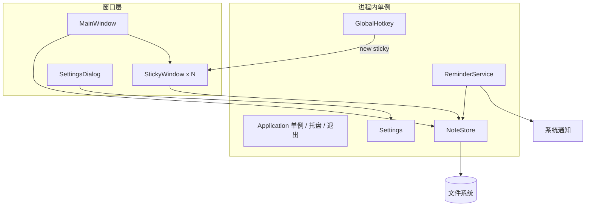
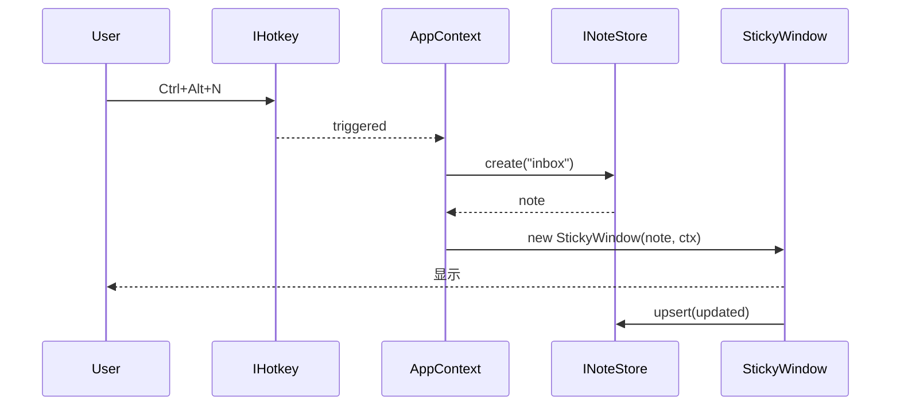
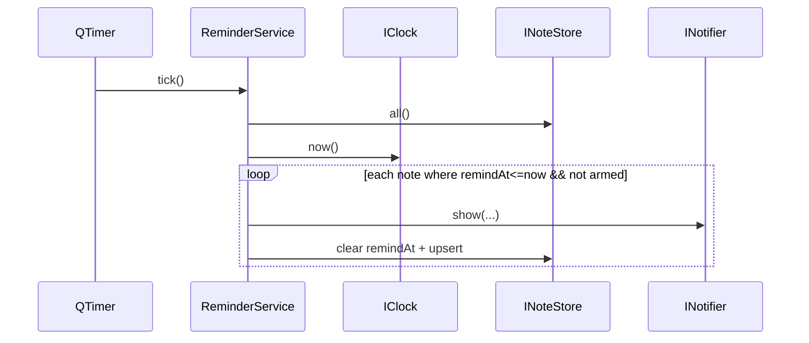

# StickyNotes 桌面便签软件 — 设计文档

| 项目 | 内容 |
| --- | --- |
| 文档日期 | 2026-06-05 |
| 项目代号 | `stickynotes` |
| 文档阶段 | 设计稿（待用户审阅） |
| 目标平台 | Windows 10/11 |
| 技术栈 | C++17、Qt 6.6+、CMake 3.21+、MSVC 2022 |
| 第三方 UI 库 | QFluentWidgets（C++，通过 FetchContent 集成） |

---

## 1. 目标与非目标

### 1.1 目标
- 提供「随时呼出、最轻量记录、集中管理」的桌面便签体验。
- 便签（轻量小窗）与主窗口笔记共用一份数据模型；便签是「入口」，主窗口是「整理与回看」。
- 视觉风格现代、克制，遵循 Windows 11 Fluent Design。

### 1.2 非目标（v1 明确不做）
- 多端同步（云端 / WebDAV / 自建后端）
- 协同编辑、共享便签
- 加密本地存储
- 多语言（i18n 仅预留接口，不做多语翻译）
- 移动端 / macOS / Linux 适配
- 便签内置浏览器、附件、便签间互相引用
- 富文本中的代码块语法高亮（v1 仅基础富文本：粗体/斜体/下划线/列表/超链接/可选图片）

---

## 2. 用户场景与需求

| 编号 | 场景 | 描述 |
| --- | --- | --- |
| S1 | 快速记录 | 任意焦点下按 `Ctrl+Alt+N`，弹出小窗，输入即记录 |
| S2 | 多便签并行 | 多次快捷键或托盘新建；可同时打开 N 个小窗，互不干扰 |
| S3 | 小窗摆放 | 小窗可自由拖拽；可置顶（`Always On Top`）；可钉屏（`Pin`，跨重启恢复位置） |
| S4 | 主窗口整理 | 打开主窗口，按分类浏览；可新建分类、改名、删除、改色；可搜索标题/正文 |
| S5 | 提醒 | 便签上可设定时提醒；到时系统 Toast 通知 + 便签闪烁高亮 |
| S6 | 主窗口编辑 | 任何便签都会自动出现在主窗口列表（默认归 `Inbox`），可在主窗口富文本编辑器中继续编辑 |
| S7 | 退出策略 | 关闭主窗口即隐藏到托盘；托盘菜单提供「退出」选项；退出才真正结束进程 |
| S8 | 设置 | 主题（亮/暗/跟随系统）、全局快捷键、提醒方式（声音开关）、开机自启 |
| S9 | 同步模型 | 同一笔记：主窗口与小窗是同一数据源的两个视图实例；同时编辑时一处为只读，避免冲突 |

---

## 3. 功能范围

### 3.1 主窗口 `MainWindow`
- 左侧：分类树（`FluentTreeView`）；支持拖拽笔记改分类、右键改色/删除/重命名
- 中部：当前分类下的笔记列表（`FluentListView`），显示标题/更新时间/置顶/提醒角标
- 右侧：富文本编辑器（`QTextEdit` + 工具条），支持：粗体/斜体/下划线/有序无序列表/超链接/插入本地图片
- 顶部：搜索框（按 `title` 与 `contentMd` 模糊匹配）
- 状态栏：当前分类笔记数、待提醒数

### 3.2 便签小窗 `StickyWindow`
- 无边框 `Qt::FramelessWindowHint | Qt::Tool`，带自定义标题栏
- 行为：
  - 自由拖拽（左键拖动标题栏；可记录位置，重启时恢复浮窗位置）
  - 置顶切换（标题栏按钮）
  - 钉屏：与置顶不同——钉屏的便签会持久化窗口位置/大小，下次启动自动浮现在原位
  - 关闭：默认「**隐藏小窗，笔记保留**」（关闭即从桌面消失，主窗口仍可见，仍可再次从主窗口以小窗方式「弹出」）
  - 字号可调（Ctrl + 滚轮或菜单）
- 富文本能力与主窗口一致（共享 `NoteEditor` 组件）
- 状态角标：若设置了提醒且未到期，显示⏰；到期闪烁

### 3.3 系统集成
- 系统托盘 `QSystemTrayIcon`：
  - **左键单击：显示/隐藏主窗口**（在则隐藏，不在则显示）
  - 右键菜单：新建便签 / 打开主窗口 / 设置 / 退出
- 全局快捷键：v1 **只 1 个**，默认 `Ctrl+Alt+N` 新建便签；可在设置页修改；底层用 Win32 `RegisterHotKey`（仅 Windows）
- 通知：到期用 `QSystemTrayIcon::showMessage`（Windows Toast）
- 开机自启：**v1 不做**（用户决策，避免修改注册表）

### 3.4 同步模型（关键设计）
- 语义前提：**一个小窗 = 一份新 `Note`**。每次"新建便签"都生成新 `id`，N 个小窗 = N 份独立笔记（满足 S2 互不干扰）。
- 同步模型仅在**同一 `Note.id` 被多处视图同时打开**时生效（例如：主窗口已选中该笔记时，又从列表"以小窗方式弹出"，或反过来）。此时：
  - 第一个视图调用 `acquire(id)` 返回 `true`，获得**可写**状态；其余视图为**只读**
  - 视图失焦/关闭/切换时 `release(id)`；当引用计数降为 0 时触发 `upsert` 落盘
- 视图实现：
  - `NoteEditor` 接受 `Mode { ReadOnly, ReadWrite }`；工具条在只读时整体禁用，状态栏显示"只读"角标
  - 主窗口与小窗都遵循同一规则：谁先获得写权限谁写，另一个切到只读
  - 列表项 / 标题 / 分类等只读字段不参与锁
- 测试要求：`INoteStore` 的 acquire/release 引用计数与可写性必须有 GoogleTest 覆盖

### 3.5 提醒调度
- 单一 `ReminderService`（`QObject`，见 4.4），持有当前所有设置了 `remindAt` 的便签
- 启动时全量加载；写入/更新/删除便签时增量维护
- 调度策略：`QTimer` 每 30 秒扫描一次；触发后清除 `remindAt` 字段（一次性提醒，不重复）
- 触发行为：系统 Toast（`INotifier`）+ 对应小窗闪烁 5 次 + 播放提示音（设置可关）

### 3.6 数据持久化
- 根目录：`%APPDATA%\StickyNotes\`（Windows）
- 文件结构：

```
StickyNotes/
├── meta.json           # 索引：分类列表 + 便签/笔记 id 列表 + 设置
├── categories/
│   └── <categoryId>.json
├── notes/
│   └── <noteId>.md     # Markdown 文件，frontmatter 存元信息
└── settings.json       # 主题/快捷键/通知/自启
```

- 每个 `*.md` 文件 frontmatter（YAML）：

```
---
id: 5b9a...
title: 第一行标题
category: inbox
tags: [work]
pinned: true
remindAt: 2026-06-10T09:00:00
createdAt: 2026-06-05T10:00:00
updatedAt: 2026-06-05T10:30:00
---
正文 Markdown...
```

- 写入策略：写新文件 → 原子替换（`QSaveFile` 或 `rename`），断电不丢
- 启动时一致性：`meta.json` 与 `notes/*.md` 互相校验；以文件系统为准

### 3.7 设置 `SettingsDialog`
| 设置项 | 类型 | 默认 | 说明 |
| --- | --- | --- | --- |
| 主题 | enum{Light, Dark, Auto} | Auto | 切换 Fluent 主题 |
| 全局快捷键 | key sequence | Ctrl+Alt+N | 仅支持单组合键 |
| 提醒声音 | bool | true | 关则无提示音 |
| 数据目录 | 路径（只读 + 打开） | %APPDATA%/StickyNotes | 暴露便于备份 |

---

## 4. 架构设计

### 4.1 总体架构



### 4.2 关键设计原则（高内聚 / 低耦合 / 可测试）

| 原则 | 落地做法 |
| --- | --- |
| **分层严格** | 分 4 层：`platform` → `core` → `app`（领域编排）→ `ui`；下层不依赖上层 |
| **面向接口编程** | 所有副作用（文件系统、托盘、快捷键、通知、时钟、UI）均通过抽象接口注入；核心逻辑零 `QWidget` 依赖 |
| **最少必要信息** | 数据结构只含功能强相关字段；UI 状态/窗口几何与笔记本体分离 |
| **单一数据源** | `NoteStore` 是笔记唯一真源；UI 不直接落盘，仅发请求 |
| **依赖注入** | 通过 `AppContext` 在启动期装配依赖（含 fake/mock 注入，便于测试） |
| **可测性优先** | 核心模块不 `#include` Qt Widgets；`Q_OBJECT` 最小化；时间、IO 走接口 |
| **YAGNI** | 不到用时不抽接口；但 platform/cross-cutting 接口一开始就抽（托盘/快捷键/通知/时钟） |
| **可替换 GUI 库** | QFluentWidgets 只出现在 `ui/`；`core/` 不感知任何具体控件库 |

### 4.3 分层与模块（每个模块只暴露一个对外头文件）

```
src/
├── platform/                  # 平台抽象 + Windows 实现
│   ├── include/platform/
│   │   ├── ifilesystem.h
│   │   ├── iclock.h
│   │   ├── inotifier.h
│   │   ├── ihotkey.h
│   │   └── itrayicon.h
│   └── win/  filesystem_win.cpp / clock_win.cpp / notifier_win.cpp
│            hotkey_win.cpp  / trayicon_win.cpp
│
├── core/                      # 纯业务逻辑，0 依赖 Qt Widgets
│   ├── include/core/
│   │   ├── note.h             # POD
│   │   ├── category.h
│   │   ├── inotestore.h       # 抽象接口
│   │   ├── notestore.h        # FileNoteStore（默认唯一实现）
│   │   ├── ischeduler.h       # 调度器接口
│   │   ├── reminder_service.h # 业务：提醒触发/清理
│   │   ├── markdown_codec.h   # HTML ⇄ Markdown 互转
│   │   └── settings.h
│   └── src/  ...对应 .cpp
│
├── app/                       # 编排层（无 UI）
│   ├── include/app/app_context.h   # 依赖注入容器
│   └── src/app_context.cpp
│
└── ui/                        # Qt Widgets + QFluentWidgets
    ├── include/ui/...
    ├── mainwindow.cpp / .h
    ├── stickywindow.cpp / .h
    ├── note_editor.cpp / .h
    └── settings_dialog.cpp / .h
```

**模块约束（编译期强制）**

| 规则 | 检查方式 |
| --- | --- |
| `core/` 不得 `#include <QtWidgets>`、`<QSystemTrayIcon>` 等 | clang-tidy / `ci/check_includes.py` |
| `core/` 不得 include `ui/` 任何头 | 同上 |
| `app/` 可 include `core/` + `platform/`，不得 include `ui/` | 同上 |
| `ui/` 不得被 `core/` 或 `app/` 反向依赖 | 编译拓扑自检 |
| 每个模块 `CMakeLists.txt` 暴露 `target_link_libraries` 私有/公有边界 | CMake 公共依赖只暴露 `INTERFACE` |

### 4.4 核心抽象（C++ 接口，全部可 mock）

```cpp
// platform/ifilesystem.h
class IFileSystem {
public:
    virtual ~IFileSystem() = default;
    virtual bool exists(const QString& path) const = 0;
    virtual std::optional<QByteArray> readAll(const QString& path) const = 0;
    virtual bool writeAtomic(const QString& path, const QByteArray& data) = 0;
    virtual QStringList list(const QString& dir, const QStringList& nameFilters) const = 0;
    virtual bool ensureDir(const QString& dir) = 0;
};

// platform/iclock.h —— 便于测试时注入假时钟
class IClock {
public:
    virtual ~IClock() = default;
    virtual QDateTime now() const = 0;
};

// platform/inotifier.h / ihotkey.h / itrayicon.h —— 同上
```

```cpp
// core/inotestore.h
// 注意：signals 出现在纯虚接口里，需要该接口类本身派生自 QObject 并带 Q_OBJECT；
// 实现类（FileNoteStore）再 emit 这些信号。
// 视图锁：acquire/release 引用计数，详见 §3.4 同步模型。
class INoteStore : public QObject {
    Q_OBJECT
public:
    virtual ~INoteStore() = default;
    virtual QList<Note> all() const = 0;
    virtual std::optional<Note> get(const QString& id) const = 0;
    virtual Note create(QString categoryId) = 0;
    virtual void upsert(const Note& n) = 0;
    virtual bool remove(const QString& id) = 0;
    virtual QList<Note> query(const QString& keyword,
                              const QString& categoryId = {}) const = 0;
    // 视图写权限：同一 id 被多处视图同时打开时互斥；详见 §3.4
    // 返回 true 表示获得写权限；返回 false 表示当前已有其它视图持有写权限
    virtual bool acquire(const QString& id) = 0;
    virtual void release(const QString& id) = 0;
    virtual bool isWritable(const QString& id) const = 0;
signals:
    void noteChanged(QString id);
    void categoryChanged(QString id);
};
```

```cpp
// core/reminder_service.h
class ReminderService : public QObject {
    Q_OBJECT
public:
    ReminderService(INoteStore& store, IClock& clock, INotifier& notifier,
                    QObject* parent = nullptr);
    void start();
    void stop();
private slots:
    void tick();                 // QTimer
    void onNoteChanged(QString id);
private:
    void fireOnce(const Note& n); // 触发后清除 remindAt
    INoteStore& store_;
    IClock& clock_;
    INotifier& notifier_;
    QTimer* timer_;
    QSet<QString> armed_;        // 已加入调度的 id
};
```

```cpp
// app/app_context.h —— 启动期装配
struct AppContext {
    std::unique_ptr<IFileSystem> fs;
    std::unique_ptr<IClock> clock;
    std::unique_ptr<INotifier> notifier;
    std::unique_ptr<IHotkey> hotkey;
    std::unique_ptr<ITrayIcon> tray;
    std::unique_ptr<INoteStore> notes;
    std::unique_ptr<ReminderService> reminders;
    std::unique_ptr<Settings> settings;
    static AppContext production(const QString& dataDir);
    static AppContext test(QTemporaryDir& tmp);  // 注入 fake/fs/clock
};
```

### 4.5 数据结构（保持最少必要信息）

```cpp
// core/note.h
struct Note {
    QString id;            // QUuid
    QString title;
    QString contentMd;     // Markdown
    QString categoryId;    // 默认 "inbox"
    QStringList tags;
    QDateTime createdAt;
    QDateTime updatedAt;
    QDateTime remindAt;    // v1 一次性
    bool pinned = false;
    QRect windowGeometry;  // 仅 pinned 有效
};
struct Category {
    QString id, name, color, parentId;
};
```

### 4.6 关键流程

**新建便签（快捷键）**



**提醒触发（Reminders）**



---

## 5. UI/UX 设计

### 5.1 视觉
- 风格：Windows 11 Fluent Design（QFluentWidgets 提供 150+ 控件，统一主题）
- 暗色/亮色：跟随系统，可在设置中覆盖
- 字体：默认 `Microsoft YaHei UI`（Win11 自带），可由用户改
- 主窗口布局：

```
┌─ StickyNotes ─────────────────────────────────┐
│ [搜索]                          [设置] [−] [×]│
├──────────┬──────────────┬──────────────────────┤
│ 分类      │ 笔记列表     │  编辑器              │
│ ▸ Inbox  │ · 标题1      │  [B I U • ...]      │
│ ▸ 工作    │ · 标题2 ⏰   │                      │
│ ▸ 学习    │ · 标题3 📌  │  正文...             │
│ + 新建    │              │                      │
└──────────┴──────────────┴──────────────────────┘
```

- 便签小窗布局：标题栏（左:拖动区 / 中:置顶切换 / 钉屏 / 字号 / 右:关闭） + 内容编辑区；窗口默认 280×240，可缩放

### 5.2 交互细节
- 关闭主窗口：弹「最小化到托盘」提示（仅首次），然后隐藏
- 便签关闭：默认「归档不删」；按住 Shift 关闭 = 「彻底删除」（v1 不做，但保留快捷键定义）
- 双击笔记列表项：若该便签未打开，弹小窗；否则主窗口聚焦
- 便签右键菜单：在主窗口打开 / 复制内容 / 设置提醒 / 删除

---

## 6. 错误与边界处理

| 场景 | 处理 |
| --- | --- |
| 数据目录无写权限 | 启动时检测 → 弹错误对话框，提示选择其它目录或退出 |
| `meta.json` 损坏 | 自动从 `notes/*.md` 重建索引；并在状态栏显示警告 |
| 单个 `.md` 损坏 | 标记为「损坏便签」，仍可显示原文；不阻塞其它便签 |
| 全局快捷键被占用 | 启动注册失败时弹提示，提示用户去设置改；周期内不重复弹 |
| 提醒时间已过 | 启动扫描时清理过期提醒（清除 `remindAt`） |
| 进程崩溃 | 写入用 `QSaveFile` 原子替换；索引与文件以文件系统为准做最终一致 |
| 同时打开多便签竞争写 | 同一 `Note` 的写串行化（`NoteStore` 内每 note 一把 `QMutex`） |

---

## 7. 构建与依赖

### 7.1 CMake 顶层（要点）
```cmake
cmake_minimum_required(VERSION 3.21)
project(StickyNotes LANGUAGES CXX)

set(CMAKE_CXX_STANDARD 17)
set(CMAKE_CXX_STANDARD_REQUIRED ON)
set(CMAKE_AUTOMOC ON)
set(CMAKE_AUTORCC ON)
set(CMAKE_AUTOUIC ON)

find_package(Qt6 6.6 REQUIRED COMPONENTS Core Gui Widgets)
qt_standard_project_setup()

# 测试：GoogleTest
include(FetchContent)
FetchContent_Declare(
    googletest
    GIT_REPOSITORY https://github.com/google/googletest.git
    GIT_TAG        v1.15.2
)
set(gtest_force_shared_crt ON CACHE BOOL "" FORCE)
FetchContent_MakeAvailable(googletest)

# UI：QFluentWidgets
FetchContent_Declare(
    qfluentwidgets
    GIT_REPOSITORY https://github.com/qtfluentwidgets/qfluentwidgets.git
    GIT_TAG        v1.0.0  # 锁定版本
)
FetchContent_MakeAvailable(qfluentwidgets)

enable_testing()
add_subdirectory(platform)
add_subdirectory(core)
add_subdirectory(app)
add_subdirectory(ui)
add_subdirectory(tests)
```

### 7.2 模块的 CMake 边界示例
```cmake
# core/CMakeLists.txt —— 公共头只暴露 INTERFACE
add_library(core STATIC
    src/note.cpp src/category.cpp src/notestore.cpp
    src/reminder_service.cpp src/markdown_codec.cpp src/settings.cpp)
target_include_directories(core PUBLIC  include)   # 只露 include/core
target_link_libraries(core  PUBLIC  Qt6::Core
                              PRIVATE platform)
# 强制：core 不可链 Qt6::Widgets
```

```cmake
# ui/CMakeLists.txt
add_library(ui STATIC
    src/mainwindow.cpp src/stickywindow.cpp
    src/note_editor.cpp src/settings_dialog.cpp)
target_link_libraries(ui PUBLIC core app platform qfluentwidgets Qt6::Widgets)
```

### 7.3 运行时依赖
- Qt 6.6+（Widgets 模块即可，无 QML/Quick）
- Windows：随安装包分发 VC++ 运行库
- 无需其他 DLL

### 7.4 第三方开源协议
| 库 | 协议 | 备注 |
| --- | --- | --- |
| Qt 6 | LGPLv3 / 商业 | 动态链接 |
| QFluentWidgets | MIT（以仓库为准） | 静态/动态皆可 |
| GoogleTest | BSD-3 | 仅测试期链接 |

---

## 8. 测试策略（GoogleTest 优先）

### 8.1 总体原则
- **测试框架**：GoogleTest + GoogleMock（`gtest/gmock`），通过 `FetchContent` 拉取
- **不依赖 Qt Test**：UI/Qt 相关用例统一走 `QGuiApplication` / `QCoreApplication` 启动，由 GoogleTest 驱动（`::testing::InitGoogleTest`）
- **测试目录**：`tests/` 与 `src/` 并列，按被测模块分子目录
- **CI**：`ctest --output-on-failure`，覆盖率 `gcovr` / `llvm-cov` 报告

### 8.2 测试分层

| 层级 | 内容 | 工具 | 运行速度 |
| --- | --- | --- | --- |
| 单元（`core/`） | 纯逻辑：`NoteStore` CRUD、`MarkdownCodec` 互转、`ReminderService` 调度策略、`Settings` 缺省值 | GoogleTest + GoogleMock（mock `IFileSystem` / `IClock` / `INotifier`） | < 100ms / 用例 |
| 集成（`platform/win`） | 真实 Win32 文件原子写、`RegisterHotKey` 占用冲突、`QSystemTrayIcon` 通知 | GoogleTest | < 1s / 用例 |
| 组件（`ui/`） | `NoteEditor` 工具条、`StickyWindow` 钉屏/置顶状态机；用 `QTest::qWaitFor` 配合 GTEST | GoogleTest + Qt Event Loop | < 2s / 用例 |
| 手工冒烟 | 真实拖拽、托盘菜单、系统通知 | — | — |

### 8.3 Mock 与 Fake（GoogleMock）

```cpp
// tests/core/mock_filesystem.h
class MockFileSystem : public IFileSystem {
public:
    MOCK_METHOD(bool, exists, (const QString&), (const, override));
    MOCK_METHOD(std::optional<QByteArray>, readAll, (const QString&), (const, override));
    MOCK_METHOD(bool, writeAtomic, (const QString&, const QByteArray&), (override));
    MOCK_METHOD(QStringList, list, (const QString&, const QStringList&), (const, override));
    MOCK_METHOD(bool, ensureDir, (const QString&), (override));
};
// FakeClock：手动推进时间
class FakeClock : public IClock {
    QDateTime t_;
public:
    explicit FakeClock(QDateTime t) : t_(std::move(t)) {}
    QDateTime now() const override { return t_; }
    void advance(std::chrono::seconds s) { t_ = t_.addSecs(s.count()); }
};
```

### 8.4 关键用例清单

| 模块 | 用例 |
| --- | --- |
| `FileNoteStore` | 启动索引重建、原子写中途断电、损坏 .md 隔离 |
| `ReminderService` | 过期清理、首次触发去重、并发 tick 不重复触发、设置/取消 remindAt 路径 |
| `MarkdownCodec` | HTML→MD 还原、列表/链接/图片、嵌套引用 |
| `Settings` | 缺省值、非法 JSON 兜底、原子写 |
| `WinHotkey` | 同热键被占用 → 返回错误码 + 错误消息 |
| `StickyWindow` | 钉屏状态切换 + 位置持久化、置顶标志切换 |

### 8.5 覆盖率与质量门禁
- `core/` 行覆盖 ≥ 80%，分支 ≥ 70%
- `platform/win` 行覆盖 ≥ 60%
- `ui/` 关键路径必须有组件测试；覆盖率不强制
- CI 必跑 `ctest` 全绿；覆盖率不达标则 fail

---

## 9. 发布与打包

- 工具：`windeployqt` + `CPack` (NSIS)
- 输出：单个 `StickyNotes-Setup-1.0.0.exe`
- 自动安装：桌面快捷方式 / 开始菜单 / 可选开机自启
- 卸载：保留用户数据目录于 `%APPDATA%\StickyNotes\`，卸载提示「是否删除数据」

---

## 10. 路线图（v1 → v1.1+）

| 版本 | 内容 |
| --- | --- |
| v1.0 | 本文档功能全集 |
| v1.1 | Markdown ↔ 富文本双视图、便签导出为图片、批量改分类 |
| v1.2 | 多快捷键（新建/打开主窗口/快速搜索）、云同步（WebDAV 插件化） |
| v2.0 | 协同 / 端到端加密 / 跨平台 |

---

## 11. 开放问题 / 待确认

| # | 问题 | 默认假设 | 影响 |
| --- | --- | --- | --- |
| Q1 | 便签是否需要「颜色便签」（黄/粉/绿） | 不做（v1） | UI 略简化 |
| Q2 | 主窗口是否要「日历视图」 | 不做 | — |
| Q3 | 便签是否需要拖拽到主窗口分类直接归档 | 不做（v1），不保留钩子 | — |
| Q4 | QFluentWidgets 版本号 | 锁定首个稳定 release tag | 需在实施前查最新 release |

---

## 12. 验收标准（v1）

- 启动后托盘可见，关闭主窗口不退出进程
- 任意焦点按 `Ctrl+Alt+N` 弹出新便签
- 小窗可拖拽、置顶、钉屏（重启后仍在原位）
- 主窗口按分类管理，可新建/改名/删分类；笔记可编辑并保存为 `*.md`
- 提醒到时系统 Toast + 小窗高亮
- 所有数据在 `%APPDATA%\StickyNotes\` 可被手动浏览与备份
- 通过单元测试 `ctest -V` 全绿
